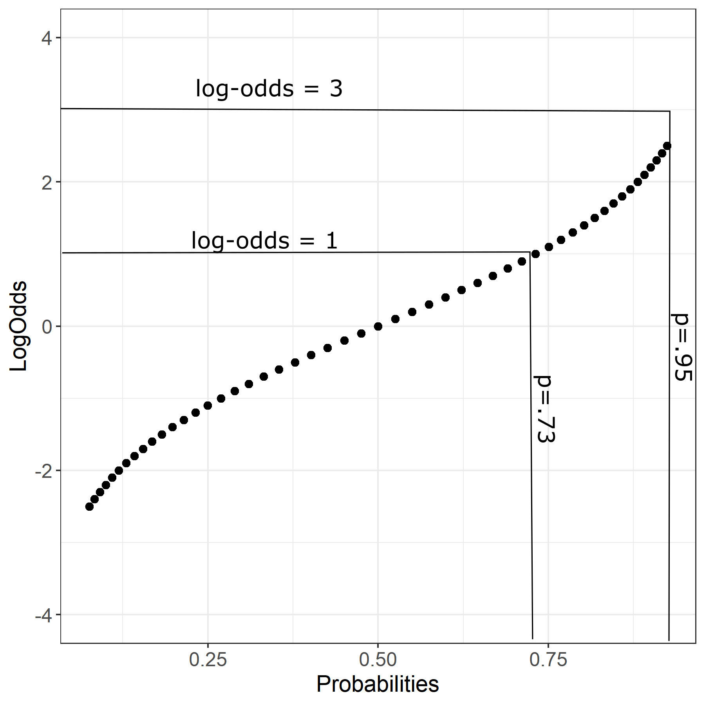

```{r setup, include=FALSE}
options(htmltools.dir.version = FALSE)
knitr::opts_chunk$set(
  fig.width=9, fig.height=3.5, fig.retina=3,
  out.width = "100%",
  cache = FALSE,
  echo = TRUE,
  message = FALSE, 
  warning = FALSE,
  hiline = TRUE
)
```

```{r xaringan-themer, include=FALSE, warning=FALSE}
library(xaringanthemer)
style_mono_accent(
  base_color = "#440099",
  header_font_google = google_font("Helvetica"),
  text_font_google   = google_font("Helvetica", "300", "300i"),
  code_font_google   = google_font("Fira Code"),
  code_font_size = '1.1rem',
  text_color = 'black',
  text_font_size = '24px',
  colors = c(red = "#f34213",
             green = "#136f63")
)
```

## Press record

---

## First meeting practice

---

## Linear regression

Gaussian distribution:
$y_{i} \sim \mathcal{N}(\mu_{i},\sigma)$ <br/> <br/>
$\mu_{i} = \alpha+\beta*x_i$ <br/><br/> 
 
```{r,fig.align='center', echo=FALSE}
par(bty='n',mar = c(5, 4, .1, .1), cex=1.1, pch=16)
data("cars")
plot(cars$speed, cars$dist, xlab='Predictor', ylab='Outcome')
abline(lm(dist~speed, data=cars), lwd=2)

```

---
## Exponential family
.center[
 <br/>
]
???
We can use all these functions as an outcome in the generalized linear models<br/>
Poisson - counts with no upper bound <br/>
Gamma - always positive, time to an event with multiple components (eg. age onset of cancer) <br/><br/>
Many of these distributions will converge to Normal: Binomial if the probability is far from edge, Poisson and Gamma if the mean is large - remember central limit theorem<br/><br/>
https://en.wikipedia.org/wiki/Exponential_family<br/><br/>
https://i.stack.imgur.com/HgpO4.jpg <br/><br/>
Check out amazing lectures from Richard McElreath (this lecture uses his idea extensively): [youtube channel](https://www.youtube.com/channel/UCNJK6_DZvcMqNSzQdEkzvzA)
---

## Binomial distribution
Distribution: <br/>
$$y_i \sim Binomial(n,p)$$ <br/><br/>

Number of successes of n number of independent Bernoulli trials -> Binomial distribution:<br/><br/><br/>
Probability mass function: $P(X=x)=(^n_x)p^x*(1-p)^{n-x}$ <br/><br/>
**.red[Mean]**: $\mu=n*p$ <br/><br/>
**.green[Variance]**: $\sigma^2=n*p(1-p)$
???
Number of successes in a sequence of n independent estimates. The probability of seeing __x__ number of successes in __n__ tries. <br/>
---

## Logistic regression

$$p=\alpha+\beta*x_i$$
--

What would happen if we would model probability using linear regression?<br/><br/>
--
Linear function is unbounded - does not have to result in a number between 0 and 1 <br/><br/>
Errors are not necessarily normal <br/><br/>
Mean and SD are related <br/>
--
<br/>
Map values to [0,1]: <br/>
$$f(p) =log(\frac{p}{1-p})$$
$$logit(p_i)=\alpha+\beta*x_i$$


???
Our y or the outcome are counts that are following Binomial distribution.<br/>
What we would like to estimate/model is the probability (p)<br/>
Mean and variance are related: [link](https://www.researchgate.net/publication/275248713/figure/fig1/AS:282627547385872@1444395066350/Mean-variance-relationships-for-different-models-A-normal-model-assumes-that-the_W640.jpg) 
---
## Probabilities
```{r, echo=FALSE}
require(ggplot2)
logit<-data.frame(LogOdds=seq(-2.5,2.5, by=.1), Pred=seq(-2.5,2.5, by=.1))
logit$Odds=exp(logit$LogOdds)
logit$Probabilities=logit$Odds/(1+logit$Odds)

ggplot(data = logit, aes(x=Pred, y=Probabilities))+geom_point(size=2)+theme_bw()+ylim(0,1)+theme(axis.title=element_text(size=14), axis.text =element_text(size=12))
```
---

## First step: odds
$$Odds =\frac{p_{i}}{1-p_{i}}$$


```{r, echo=FALSE, message=FALSE, fig.align='center'}
ggplot(data = logit, aes(x=Pred, y=Odds))+geom_point(size=2)+theme_bw()+ylim(0,13)+theme(axis.title=element_text(size=14), axis.text =element_text(size=12))
```
???
Odds - likelihood of an outcome. Probability that event would occur versus the probability that event will not occur. <br/> <br/>
Odds ratios (often used as a same thing as __odds__) but in research used as a ratio of two different odds. The odds of event A happening in the case when B present, versus the odds of event happening in absence of B (e.g. medication).
---
## Second step: log odds

$$logOdds =log(\frac{p_{i}}{1-p_{i}})$$

```{r, echo=FALSE, message=FALSE, fig.align='center'}
ggplot(data = logit, aes(x=Pred, y=LogOdds))+geom_point(size=2)+theme_bw()+ylim(-4,4)+theme(axis.title=element_text(size=14), axis.text =element_text(size=12))
```

???
The odds distribution is always positive and it is increasing exponentially, which means that we would like to unbound it to go also towards negative values and to be linear <br/>
---

## What is the model doing: log odds space?


---

## What is the model doing: probability space?


???
We are squeezing the logit values in a probability space 
---

## Relation between LogOdds and Probabilities
.center[

]
---

## Logistic regression in R

We return back to our crying babies that are motivated to start crawling. 


```{r,echo=F}
set.seed(456)
Babies=data.frame(Age=round(runif(100,1,30)), Weight=rnorm(100,4000,500))
Babies$Height=rnorm(100,40+0.2*Babies$Age+0.004*Babies$Weight, 5)
Babies$Gender=rbinom(100,1,0.5)
Babies$Crawl=rbinom(100,1,0.031*Babies$Age+0.00001*Babies$Weight-0.06*Babies$Gender)
Babies$Gender=as.factor(Babies$Gender)
levels(Babies$Gender)=c('Girls','Boys')
```

```{r, fig.align='center', echo=FALSE}
par(mfrow=c(1,3), bty='n',mar = c(5, 4, .1, .1), cex=1.1, pch=16)
plot(Babies$Age, Babies$Height, xlab='Age (months)', ylab='Height (cm)')
boxplot(Babies$Height~Babies$Gender,xlab='Gender', ylab='Height (cm)')
boxplot(Babies$Age~Babies$Crawl,xlab='Crawl', ylab='Age (months)')
```

---

## Logistic regression in R: coefficients

Predict crawling success as a linear function of age

```{r}
glm1 <- glm ( Crawl ~ Age, data = Babies, family = binomial ( link = 'logit' ))
glm1 $ coefficients
```
<br/><br/>
Three ways to interpret logistic regression:<br/><br/>
 1. Logit values<br/>
 2. **.red[Odds]**<br/>
 3. **.green[Probabilities]**<br/>

---
## Odds ratio space

Odds:
```{r}
exp ( glm1 $ coefficients )
```

Intercept: When Age is **.red[zero]**, the **.red[odds]** of babies crawling are 74% (1-.26) **.green[less likely]** than odds of crawling.  

Age: Babies **.red[one month older]** are 12% more likely to start crawling OR unit increase in Age **.green[increases the odds]** of crawling by a factor of 1.12 

???
For 0.26 baby that crawls, you will have 1 baby that does not crawl <br/><br/>
Or we can invert the odds:1/0.26 = 3.84 <br/>

At Age 0 (birth), it is 3.84 times more likely for babies not to crawl than to crawl. <br/> 
For every 3.84 babies that do not crawl you will have 1 that does. <br/><br/>

---

## Probability space: intercept

Logit to probability space: $$\frac{1}{1+exp^{-(\alpha+\beta*x)}}$$<br/>


Intercept: Estimated probability of babies starting to crawl when Age is 0 (birth) <br/>

```{r}
1 / ( 1 + exp ( - ( -1.33078 + 0.119 * 0)))
```

---

## Probability space: slope

We need to look where to evaluate changes on the curve:<br/>

```{r}
1 / ( 1 + exp( 1.33078 - 0.11948 * 10))
arm::invlogit(coef( glm1 )[[ 1 ]] + coef( glm1 )[[ 2 ]] * mean( Babies $ Age ))
```

Estimated probability of babies starting to crawl when Age is 10 or mean of the sample

---

## Interpretation continued

```{r, fig.width=12, fig.height=5, fig.align='center'}
Babies$LogOdds=-1.33078+0.11948*Babies$Age
Babies$Odds=exp(Babies$LogOdds)
Babies$Probs=Babies$Odds/(1+Babies$Odds)
```
```{r, echo=FALSE}
par(mfrow=c(1,3), bty='n',mar = c(5, 4, .1, .1), cex=1.1, pch=16)
plot(Babies$Age,Babies$LogOdds, xlab='Age', ylab='Log Odds')
plot(Babies$Age, Babies$Odds, xlab='Age', ylab='Odds')
plot(Babies$Age,Babies$Probs, xlab='Age', ylab='Probabilities')
```

???

This is the connection between the log odds, odds and probabilities in our data, based on our model. 
---

## Predicted probability versus outcome

```{r,fig.align='center'}
ggplot(data=Babies, aes(x=Age, y=Probs))+geom_point(size=3, col='blue')+geom_point(data=Babies, aes(x=Age, y=Crawl), size=3, col='red')
```
???
The red dots indicate the observed crawling values (1 and 0) - whether baby is crawling or not given their age. The blue dots are predicted probabilities by the model. 
---
## Relationship between probabilities and odds

Probability: $p = \frac{f}{N}$<br/>
Expectations of how many times we will see event in N number of trials (between 0 and 1) <br/><br/><br/>
Odds of event: $odds = \frac{p}{1-p}$ (between 0 and positive infinity)  <br/>
Probability that the event will occur divided by the probability that event will not occur <br/><br/><br/>

p = 0.80<br/>
odds = $\frac{0.80}{0.20}=4$ - odds are 4 to 1 that the event will occur <br/>
p = 0.20<br/>
odds= $\frac{0.20}{0.80}=0.25$ - odds are 0.25 to 1 that the event will occur <br/><br/><br/>
If a race horse runs 100 races and wins 25 times and loses 75 of times, the probability of winning is 25/100 = 0.25 or 25%, but the odds of the horse winning are 25/75 = 0.333 or 1 win to 3 loses <br/>

---

## Logistic regression formula

What is missing in this equation? 

$$log(\frac{p}{1-p})=\alpha+\beta*x_i$$ <br/> <br/>

$$ y = \alpha + \beta * Age + \epsilon $$  <br/><br/>

--

We do not have an estimation of error: $y_i \sim Binomial(n,p)$

We do have residuals - estimate of the fit <br/>

$$residual_i=-2*(y_i-logit^{-1}(\beta*x_i))$$

---

## Deviance

Goodness of fit: deviance of the fitted model with respect to a perfect model <br/><br/>
Null deviance: $D=-2*loglik(\beta_0)$ <br/><br/>
Residual deviance: $D=-2*loglik(\beta*x)$ <br/><br/>

```{r}
with(glm1, pchisq(null.deviance - deviance, df.null - df.residual, lower.tail = FALSE))
```

AIC: $-2loglik(\beta*x)+2*npar$<br/><br/>
BIC: $-2loglik(\beta*x)+log(number of observations)*npar$

???
Deviance: difference in categorising outcomes in comparison to the perfect model<br/>
Likelihood: the probability of the observed results given the parameter estimates <br/>
AIC and BIC are used to compare the models: [link](https://stats.stackexchange.com/a/767)
---

```{css, echo=FALSE}
pre {
  max-height: 300px;
  overflow-y: auto;
}

pre[class] {
  max-height: 100px;
}
```

```{css, echo=FALSE}
.scroll-100 {
  max-height: 100px;
  overflow-y: auto;
  background-color: inherit;
}
```

## Model results

```{r}
summary(glm1)
```
???
[Wald test](https://stats.stackexchange.com/a/60083)

---

## Link functions and other GLMs

 Most common Generalized linear models:
 - Poisson regression: traffic, goals in a soccer game <br/>
 - Negative binomial: same problems but deals with overdispersion <br/>
 - Gamma regression: reaction times? always positive right skewed data <br/>
---
## Absolutely cool things to note 

The question that we are asking is can we stratify the probability of a success in outcome using our predictor variables <br/><br/>

We are modelling the mean and we do not have an information on individual data points - no error <br/><br/>

The scale of parameters is different! <br/><br/>

Parameters are multiplicative - coefficient interact, especially in the tails of probability distribution <br/><br/>

Not easy to compare the models - especially if they differ in a more than one predictor - deviance criteria gives you information how well you model fits the mean <br/>
---

class: inverse, middle, center
# Practical aspect
---


## Data

NBA dataset: [Link](https://www.kaggle.com/ionaskel/nba-games-stats-from-2014-to-2018)

```{r}
basketball<-read.table('Basketball.txt',sep='\t', header=T)
knitr::kable(head(basketball[,c(5,13,18,31,34,43)]), format = 'html')
```
---
## Important aspects: theory

- How do we use linear model with the non-normal outcomes (link functions) <br/><br/>
- What are logit values, how do we get to them <br/><br/>
- How to interpret logistic regression: logits, odds, and probabilities<br/><br/>
- What is deviance of the model and AIC 

---
## Important aspects: practice

- Building a logistic model <br/><br/>
- Predicting values from logistic model <br/><br/>
- Transforming logit values to odds and to probabilities<br/><br/>
- Comparing models using deviance, anova function or AIC information<br/><br/>
- Cross-tabulating model predictions with observed data

---
## Literature

Chapter 5 of "Data Analysis Using Regression and Multilevel/Hierarchical Models" by Andrew Gelman and Jennifer Hill  <br/>

Chapter 10 of "Statistical Rethinking: A Bayesian Course with Examples in R and Stan " by Richard McElreath + check out his youtube channel

Jaeger, F. (2008). Categorical data analysis: Away from ANOVAs (transformation or not) and towards logit mixed models. Journal of Memory and Language, 59, 434-446. 

---

## Song for the end

[Link](https://youtu.be/ZINXFoQMZVs)

---

# Thank you for your attention